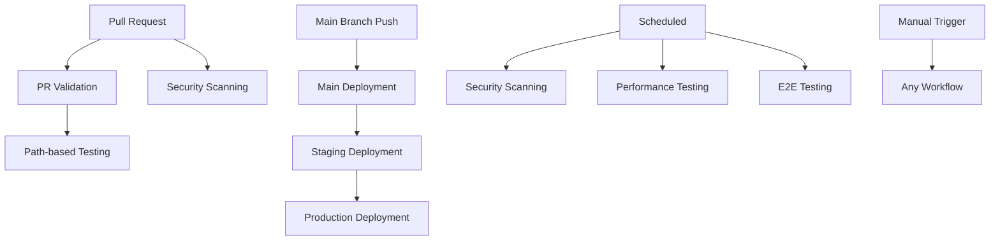

# EA Financial - CI/CD Workflows Documentation

This document provides comprehensive documentation for the GitHub Actions CI/CD workflows implemented for EA Financial's banking applications.

## Overview

Our CI/CD pipeline is designed to meet the stringent requirements of a global banking institution, ensuring:
- **Security-first approach** with comprehensive vulnerability scanning
- **Compliance** with banking regulations (PCI DSS, SOX, ADA)
- **High availability** through extensive testing and monitoring
- **Risk mitigation** with staged deployments and rollback capabilities

## Workflow Architecture



## Workflows

### 1. PR Validation (`pr-validation.yml`)

**Trigger:** Pull requests to `main`, `develop`, `release/*` branches
**Purpose:** Comprehensive validation before code integration

#### Features:
- **Security & Compliance Checks**
  - Trivy vulnerability scanning
  - GitGuardian secrets detection
  - License compliance verification
  - OPA policy validation

- **Code Quality**
  - TypeScript type checking
  - ESLint and Prettier validation
  - Code formatting verification

- **Testing**
  - Unit tests with coverage reporting
  - Integration tests with service dependencies
  - End-to-end testing with Playwright
  - Performance impact analysis

- **Container Security**
  - Docker image vulnerability scanning
  - Container hardening validation

#### Success Criteria:
- All security scans pass
- Code quality checks pass
- Test coverage > 80%
- No critical vulnerabilities
- Performance benchmarks met

### 2. Main Branch Deployment (`main-deployment.yml`)

**Trigger:** Push to `main` branch or manual dispatch
**Purpose:** Production deployment pipeline

#### Features:
- **Pre-deployment Validation**
  - Smoke tests execution
  - Version generation
  - Deployment readiness checks

- **Container Build & Push**
  - Multi-architecture builds (AMD64, ARM64)
  - Container signing with Cosign
  - Registry push to GHCR

- **Staged Deployment**
  - Staging environment deployment
  - Blue-green production deployment
  - Health checks and verification

- **Post-deployment**
  - GitHub release creation
  - Monitoring dashboard updates
  - Slack notifications

#### Deployment Environments:
1. **Staging** - Automatic deployment for testing
2. **Production** - Manual approval required

### 3. Path-based Testing (`path-based-testing.yml`)

**Trigger:** PRs and pushes with intelligent path detection
**Purpose:** Efficient testing by running only relevant tests

#### Path Detection:
- `projects/consumer-accounts-internal-api/**` → API tests
- `projects/consumer-accounts-internal-app/**` → App tests
- `infra/**` → Infrastructure tests
- `infra/opa/**` → Policy tests
- `**/*.md` → Documentation checks

#### Benefits:
- Reduced CI execution time
- Lower resource consumption
- Faster feedback loops
- Focused testing efforts

### 4. Security Scanning (`security-scan.yml`)

**Trigger:** Daily schedule (2 AM UTC) or manual dispatch
**Purpose:** Comprehensive security assessment

#### Scan Types:
- **Dependencies** - NPM audit, Trivy filesystem scan
- **Containers** - Image vulnerability assessment
- **Secrets** - GitGuardian, TruffleHog patterns
- **Compliance** - Banking regulations (PCI DSS, SOX)
- **Infrastructure** - Kubernetes security, Docker best practices

#### Banking-Specific Checks:
- Credit card number patterns
- SSN detection
- Banking account number references
- Audit logging compliance
- Encryption standards validation

### 5. Performance Testing (`performance-testing.yml`)

**Trigger:** Weekly schedule (Sundays 3 AM UTC) or manual dispatch
**Purpose:** Banking-grade performance validation

#### Test Types:
- **Load Testing** - Normal traffic patterns
- **Stress Testing** - Breaking point identification
- **Spike Testing** - Sudden traffic surge handling
- **Volume Testing** - Large dataset processing
- **Benchmark Testing** - Performance baseline establishment

#### Banking Requirements:
- API response time (P95) < 2 seconds
- API response time (median) < 500ms
- Availability > 99.9%
- Error rate < 0.1%
- Support 1000+ concurrent users

### 6. E2E Testing (`e2e-testing.yml`)

**Trigger:** Daily schedule (4 AM UTC), PRs, or manual dispatch
**Purpose:** Complete user journey validation

#### Test Suites:
- **Smoke Tests** - Basic functionality validation
- **Critical Paths** - Core banking workflows
- **Accessibility** - WCAG 2.1 AA compliance
- **Regression** - Cross-browser compatibility

#### Banking Workflows Tested:
- Employee authentication
- Account lookup and details
- Transaction history review
- Customer information access
- Compliance and audit trails
- Session management and security

## Security Features

### Secrets Management
- GitHub Secrets for sensitive data
- Environment-specific configurations
- API keys and tokens protection

### Container Security
- Image vulnerability scanning
- Non-root user enforcement
- Minimal base images
- Security policy validation

### Compliance Monitoring
- PCI DSS requirement checks
- SOX compliance validation
- ADA accessibility standards
- Audit trail verification

## Environment Configuration

### Required Secrets

#### Authentication & Registry
```
GITHUB_TOKEN                 # Automatic (GitHub provided)
GITGUARDIAN_API_KEY         # GitGuardian secret scanning
COSIGN_PRIVATE_KEY          # Container image signing
```

#### AWS/Cloud Infrastructure
```
AWS_ACCESS_KEY_ID           # Staging environment access
AWS_SECRET_ACCESS_KEY       # Staging environment secret
AWS_ACCESS_KEY_ID_PROD      # Production environment access
AWS_SECRET_ACCESS_KEY_PROD  # Production environment secret
```

#### Monitoring & Notifications
```
SLACK_WEBHOOK_URL           # Team notifications
GRAFANA_API_URL            # Performance monitoring
GRAFANA_API_KEY            # Dashboard updates
```

#### Testing
```
E2E_TEST_TOKEN_PROD        # Production E2E testing (if applicable)
```

### Environment Variables

#### Default Configurations
```yaml
NODE_VERSION: '20'
BUN_VERSION: '1.2.22'
REGISTRY: ghcr.io
IMAGE_NAME: ${{ github.repository }}
```

## Usage Examples

### Manual Workflow Triggers

#### Run Security Scan
```bash
# Via GitHub CLI
gh workflow run security-scan.yml \
  --field scan_type=full \
  --field severity_threshold=HIGH

# Via API
curl -X POST \
  -H "Authorization: Bearer $GITHUB_TOKEN" \
  -H "Accept: application/vnd.github.v3+json" \
  https://api.github.com/repos/OWNER/REPO/actions/workflows/security-scan.yml/dispatches \
  -d '{"ref":"main","inputs":{"scan_type":"full"}}'
```

#### Deploy to Production
```bash
gh workflow run main-deployment.yml \
  --field environment=production \
  --field skip_tests=false
```

#### Run Performance Tests
```bash
gh workflow run performance-testing.yml \
  --field test_type=load \
  --field target_environment=staging \
  --field duration=15 \
  --field users=100
```

### Monitoring Workflow Status

#### Check Workflow Runs
```bash
# List recent workflow runs
gh run list --workflow=pr-validation.yml --limit=10

# View specific run
gh run view [RUN_ID]

# View logs
gh run view [RUN_ID] --log
```

#### Download Artifacts
```bash
# List artifacts
gh run list --workflow=security-scan.yml
gh api repos/:owner/:repo/actions/runs/[RUN_ID]/artifacts

# Download specific artifact
gh run download [RUN_ID] --name consolidated-security-report
```

## Best Practices

### Pull Request Workflow
1. Create feature branch from `main`
2. Implement changes with tests
3. Push branch to trigger path-based testing
4. Create PR to trigger full validation
5. Address any failing checks
6. Obtain required approvals
7. Merge triggers deployment pipeline

### Security Considerations
- Never commit secrets or sensitive data
- Use environment-specific configurations
- Regularly rotate API keys and tokens
- Monitor security scan results daily
- Address critical vulnerabilities immediately

### Performance Monitoring
- Review performance test results weekly
- Set up alerts for performance degradation
- Establish performance budgets for new features
- Monitor production metrics continuously

### Compliance Management
- Ensure all regulatory checks pass
- Document compliance violations and remediation
- Regular compliance review meetings
- Maintain audit trails for all changes

## Troubleshooting

### Common Issues

#### Workflow Failures
```bash
# Check workflow status
gh run list --workflow=WORKFLOW_NAME --limit=5

# View detailed logs
gh run view [RUN_ID] --log --job=[JOB_NAME]

# Re-run failed jobs
gh run rerun [RUN_ID] --failed
```

#### Security Scan False Positives
1. Review scan results in artifacts
2. Verify if finding is legitimate
3. If false positive, add to allowlist
4. Document decision in security log

#### Performance Test Failures
1. Check if infrastructure was under load
2. Review performance thresholds
3. Analyze performance trends over time
4. Consider scaling infrastructure if needed

### Debug Mode
Add debugging to workflows by setting:
```yaml
env:
  DEBUG: true
  ACTIONS_STEP_DEBUG: true
  ACTIONS_RUNNER_DEBUG: true
```

## Metrics & KPIs

### CI/CD Performance
- **Mean Time to Feedback:** < 15 minutes
- **Deployment Frequency:** Multiple per day
- **Lead Time for Changes:** < 2 hours
- **Mean Time to Recovery:** < 30 minutes

### Quality Metrics
- **Test Coverage:** > 80%
- **Critical Vulnerabilities:** 0
- **High Vulnerabilities:** < 5
- **Performance Regression:** 0%

### Compliance Metrics
- **Security Scan Compliance:** 100%
- **Accessibility Compliance:** WCAG 2.1 AA
- **Policy Compliance:** 100%
- **Audit Trail Coverage:** 100%

## Support & Maintenance

### Team Responsibilities
- **DevOps Team:** Workflow maintenance and infrastructure
- **Security Team:** Security scan reviews and policy updates
- **QA Team:** Test maintenance and E2E scenario updates
- **Development Team:** Code quality and test coverage

### Regular Maintenance
- **Weekly:** Review performance and security reports
- **Monthly:** Update dependencies and tools
- **Quarterly:** Review and update policies
- **Annually:** Comprehensive security audit

### Contact Information
- **DevOps Team:** `@devops-team`
- **Security Team:** `@security-team`
- **On-call:** `#incident-response`

---

**Last Updated:** December 2024
**Version:** 1.0.0
**Maintained by:** EA Financial Engineering Team